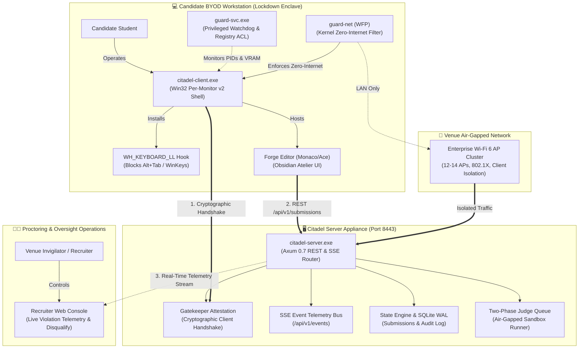

# 🛡️ CITADEL — Offline Air-Gapped Assessment Platform & Hardened Lockdown Enclave

<div align="center">


<br/>

**A fully air-gapped, zero-cloud assessment platform and privileged Windows lockdown client engineered to conduct high-stakes coding Online Assessments (OAs) for 400–700 concurrent candidates inside college placement centers and enterprise recruitment halls.**

[Interactive Maps](#-interactive-architecture-maps--visual-graph-navigators) •
[System Architecture](#-system-architecture--end-to-end-data-flow) •
[Defining Invariants](#-the-five-defining-architectural-invariants) •
[Repository Layout](#-repository-structure--crate-taxonomy) •
[Documentation Catalog](#-complete-system-design-specification-suite-docs) •
[Dual Modes](#-dual-operational-modes-testing-vs-production) •
[Quickstart](#-getting-started--developer-operations) •
[Emergency Recovery](#-emergency-failsafe--workstation-restoration)

</div>

---

## 🎯 Executive Summary & The BYOD Zero-Internet Thesis

Every existing commercial lockdown browser (Mercer Mettl MSB, Safe Exam Browser, HackerEarth) assumes an active internet connection to cloud SaaS backends. Under an internet uplink, candidates exploit an expansive bypass surface: remote desktop mirrors, hidden Discord streams, Telegram web bots, cloud LLM APIs (ChatGPT/Claude), and covert reverse tunnels.

**CITADEL fundamentally eliminates this vulnerability by severing the internet entirely.**

```
┌─────────────────────────────────────────────────────────────────────────────────────────┐
│                                THE CITADEL GUARANTEE                                    │
│                                                                                         │
│  "Every commercial lockdown bypass method requires an active outbound internet uplink.   │
│   By running exclusively on an air-gapped, appliance-owned local Wi-Fi 6 network with   │
│   zero internet routing, Citadel collapses the remote cheating attack surface to zero." │
└─────────────────────────────────────────────────────────────────────────────────────────┘
```

The only remaining threats on BYOD laptops are local machine tools (e.g., local LLMs running via Ollama or llama.cpp) and out-of-band physical devices (e.g., a phone under the desk). CITADEL neutralizes local machine tools at the operating system and kernel level, while physical devices are governed by venue invigilation.

### 🌟 Key Platform Capabilities

| Dimension | Architectural Capability | Production Reality |
|---|---|---|
| **Zero Internet** | Structural elimination of venue internet uplink | WFP kernel firewall drops non-LAN packets; no cloud calls ever occur. |
| **No Third-Party Kiosk** | Custom Win32 Per-Monitor v2 client | Replaces SEB; controls processes, registry keys, and sockets, not just a window. |
| **Local LLM Defeat** | Behavioral detection (M1–M5) | Detects loopback socket bindings, dedicated GPU VRAM consumption, and capture flags. |
| **Hidden Test Integrity** | Two-phase judging pipeline | Candidates only execute public tests; hidden grading test suites never leave the server. |
| **Graceful Resilience** | Multi-tier Write-Ahead Logs (WAL) | Submissions persist locally if Wi-Fi degrades; automatically sync upon reconnection. |
| **Hardware Agnostic** | Candidate BYOD support | Statically linked MSVC binaries (`crt-static`) with zero external runtime requirements. |

---

---

## 🗺️ Interactive Architecture Maps & Visual Graph Navigators

CITADEL provides two distinct, interactive graphical explorers for visual architectural inspections:

| Visual Explorer | Technology | Live Server Route | Local Standalone File | Purpose & Focus |
|---|---|---|---|---|
| **System Architecture Canvas** | [Archify](https://github.com) (SVG / Pan & Zoom) | [`/architecture`](http://localhost:8443/architecture) or [`/archify`](http://localhost:8443/archify) | [`.archify/citadel-architecture.html`](.archify/citadel-architecture.html) | High-level system boundary layout, network topologies, subsystem data flows, and security zones. |
| **Codebase Knowledge Graph** | [Graphify](https://github.com) (vis-network / Force) | [`/graph`](http://localhost:8443/graph) or [`/graphify`](http://localhost:8443/graphify) | [`graphify-out/graph.html`](graphify-out/graph.html) | Deep AST dependency graph, crate inter-relationships, call hierarchies, and cross-file linkage. |
| **Recruiter Proctoring Console** | Citadel LMS (Obsidian Atelier) | [`/recruiter`](http://localhost:8443/recruiter) | [`citadel-server/templates/recruiter.html`](citadel-server/templates/recruiter.html) | Live exam monitoring dashboard with direct links to both Archify and Graphify visualizers. |
| **Student Assessment Portal** | Monaco / Ace Editor (Forge) | [`/exam`](http://localhost:8443/exam) | [`citadel-server/templates/portal.html`](citadel-server/templates/portal.html) | Candidate coding environment, test runner, and air-gapped problem solver. |

> 💡 **Live Web Access**: When running `citadel-server` (`cargo run -p citadel-server` or `citadel-server.exe`), simply visit [`http://localhost:8443/architecture`](http://localhost:8443/architecture) for the Archify diagram or [`http://localhost:8443/graph`](http://localhost:8443/graph) for the Graphify knowledge graph.

---

## 🏛️ System Architecture & End-to-End Data Flow

CITADEL operates across three strictly bounded security regions: the **Student Workstation (Lockdown Enclave)**, the **Air-Gapped Venue LAN**, and the **Citadel Appliance Infrastructure**:



### 💎 Core Architectural Cards

- **🛡️ Hardened Kiosk Enclave & Per-Monitor v2 DPI**: Win32 Per-Monitor v2 DPI awareness prevents font blur across laptops with 125%/150% scaling. The `WH_KEYBOARD_LL` low-level hook traps and blocks Alt+Tab, Windows keys, Task Manager (`Ctrl+Shift+Esc`), and browser DevTools shortcuts.
- **⏱️ 15-Minute Early Exit Rule & Disqualification Lockdown**: In Production Mode, candidates cannot submit early if >15 minutes remain in the examination. A live countdown modal blocks submission attempts. If a candidate is disqualified by a proctor, their workstation remains strictly locked down until the hall-wide exam concludes.
- **🎨 Offline Obsidian Atelier UI & State Persistence**: Self-hosted Geist and Geist Mono variable fonts are embedded into the server binary, preventing layout shifts on air-gapped networks. SQLite and JSON write-ahead logs guarantee that candidate state is never lost across crashes or reboots.

---

## ⚡ The Five Defining Architectural Invariants

Every subsystem across the CITADEL codebase is governed by five non-negotiable architectural decisions:

1. **D1 — Pre-stage the exam bundle; release only a 32-byte key at T=0.**  
   *The Problem*: 600 candidates simultaneously downloading a 5 MB question bundle creates a 3 GB bandwidth stampede that crashes campus Wi-Fi APs.  
   *The Solution*: Bundles are pre-staged onto student machines in advance. At T=0, the appliance broadcasts a single 32-byte AES-256 decryption key (~20 KB total traffic), turning a massive spike into a negligible burst.
2. **D2 — Built-in Monaco/Ace editor; strictly no third-party IDEs or terminals.**  
   *The Problem*: Standard assessment setups allowing VS Code or system shells hand candidates an arbitrary code execution and socket creation environment.  
   *The Solution*: CITADEL ships Forge, an integrated code editor inside the hardened kiosk with a constrained local test runner limited strictly to public sample test cases.
3. **D3 — Enforce at the OS and Kernel layer, not the window layer.**  
   *The Problem*: Safe Exam Browser is a user-mode kiosk window; processes running beneath it (local LLMs, screen scrapers) operate unnoticed.  
   *The Solution*: CITADEL Guard is an elevated background service (`guard-svc`) and kernel filtering driver (`guard-net`) controlling process creation, registry ACLs, and network sockets.
4. **D4 — Detect behavioral techniques, not static process filenames.**  
   *The Problem*: Blacklisting `ollama.exe` is defeated the moment a student renames the binary to `svchost.exe`.  
   *The Solution*: CITADEL inspects behavioral telemetry: unauthorized loopback listeners (e.g. ports 11434, 8080), dedicated GPU VRAM allocations, and `WDA_EXCLUDEFROMCAPTURE` window flags.
5. **D5 — Multi-Tier Write-Ahead Log (WAL) at every layer.**  
   *The Problem*: Campus Wi-Fi is inherently prone to transient radio packet drops and interference.  
   *The Solution*: The Client, Edge nodes, and Appliance each maintain an append-only WAL. Candidates code uninterrupted during network loss, and pending submissions queue locally and flush automatically upon reconnection.

---

## 📁 Repository Structure & Crate Taxonomy

The repository is structured as a high-cohesion, low-coupling Rust workspace complemented by documentation, scripts, and pre-built distribution binaries:

```
citadel-design/
├── .archify/                    # Visual architecture diagrams and sync state
├── .cargo/                      # Workspace Cargo configuration (static CRT linkage)
├── bin/                         # Pre-compiled standalone 64-bit Windows release binaries
│   ├── README.md                # Binary usage, verification checksums, and build flags
│   ├── citadel-client.exe       # Production lockdown kiosk client
│   ├── citadel-server.exe       # Air-gapped exam appliance and REST/SSE server
│   └── citadel-recovery.exe     # Emergency desktop restoration utility
├── citadel-client/              # [CRATE] Hardened Win32 BYOD Lockdown Client
│   ├── build.rs                 # Win32 application manifest compilation (Per-Monitor v2 DPI)
│   ├── Cargo.toml               # Client crate dependencies (windows 0.58)
│   └── src/
│       ├── main.rs              # Client CLI entry point & coordinator initialization
│       ├── kiosk_window.rs      # Chromium/Edge kiosk window runner
│       ├── hotkey_lock.rs       # Low-level WH_KEYBOARD_LL keyboard hook
│       ├── local_control.rs     # Local IPC and loopback coordination API
│       ├── registry_lock.rs     # Windows registry policy keys (DisableTaskMgr, NoWinKeys)
│       ├── explorer_lock.rs     # Explorer shell termination & respawn watchdog
│       ├── pre_flight.rs        # UAC verification, display check, application termination
│       ├── security_coordinator.rs # Lifecycle coordinator for all security subsystems
│       └── bin/recovery.rs      # Source for standalone citadel-recovery.exe
├── citadel-server/              # [CRATE] Air-Gapped Venue Exam Appliance
│   ├── Cargo.toml               # Server crate dependencies (axum 0.7, tokio, serde)
│   ├── src/
│   │   ├── main.rs              # Appliance entry point, CLI parser, & background workers
│   │   ├── api.rs               # REST routes, SSE violation telemetry, & gatekeeper
│   │   ├── judge.rs             # Two-phase sandboxed code execution runner
│   │   ├── persistence.rs       # SQLite database & JSON state persistence engine
│   │   ├── questions.rs         # Problem catalog & encrypted test bundle loader
│   │   └── ui.rs                # Template rendering & static asset routing
│   ├── static/                  # Embedded static assets (Ace editor, offline Geist fonts)
│   └── templates/               # Server HTML templates (portal.html, recruiter.html, etc.)
├── docs/                        # Complete 21-Document Architecture & Specification Suite
│   ├── README.md                # Master specification index, reading order, and glossary
│   ├── architecture/            # SDD, HLD, Security Architecture, Golden Rules
│   ├── subsystems/              # Low-Level Designs (LLDs 03 through 11)
│   ├── operations/              # Capacity planning, threat models, operational modes
│   └── roadmap/                 # Roadmaps, senior reviews, and execution playbooks
├── guard-net/                   # [CRATE] Windows Filtering Platform (WFP) Kernel Firewall
│   ├── Cargo.toml               # WFP crate dependencies
│   └── src/lib.rs               # WFP sub-layer management, ALE network rules, zero-internet
├── guard-svc/                   # [CRATE] Privileged Windows Background Service & Watchdog
│   ├── Cargo.toml               # Service crate dependencies
│   └── src/
│       ├── main.rs              # Windows Service Control Manager (SCM) entry point
│       ├── lib.rs               # Guard service daemon & process monitor
│       └── llm_detect.rs        # Behavioral loopback & GPU VRAM LLM detection engine
├── guard-verify/                # [CRATE] Pre-Flight Diagnostics & Security Test Harness
│   ├── Cargo.toml               # Verification test suite dependencies
│   └── src/bin/
│       ├── test_college_lan_isolation.rs # Validates zero-internet firewall packet dropping
│       ├── loopback_scan_test.rs         # Scans local loopback listener ports
│       ├── fake_injected_keystrokes.rs   # Verifies keyboard hook blocks synthetic input
│       └── fake_capture_excluded_window.rs # Verifies screen capture exclusion traps
├── scripts/                     # Operational Automation, Recovery Scripts, & Test Fixtures
│   ├── windows/                 # Windows administrative & emergency batch scripts
│   │   ├── RESTORE_MY_LAPTOP.bat # Comprehensive desktop, registry, and service restoration
│   │   ├── citadel-recovery.bat # Standalone recovery launcher
│   │   └── citadel-restore.bat  # Fast policy reset script
│   ├── tests/                   # Test automation & portal mock fixtures
│   │   └── portal_test.js       # Client portal verification test script
│   └── sync-archify.mjs         # Visual architecture sync script
├── Cargo.toml                   # Root Cargo workspace manifest
├── Cargo.lock                   # Deterministic workspace dependency lockfile
├── package.json                 # Node.js tooling scripts (Archify architecture sync)
├── RESTORE_MY_LAPTOP.bat        # Root 1-click convenience forwarder to emergency recovery
├── .env.example                 # Production environment variable configuration template
├── .gitignore                   # Comprehensive production gitignore
└── README.md                    # Flagship repository documentation
```

### 🧩 Workspace Crates Breakdown

| Crate | Binary / Library | Tech Stack | Role & Responsibility |
|---|---|---|---|
| [`citadel-server`](citadel-server/) | `citadel-server.exe` | Rust (Axum 0.7, Tokio, SQLite) | High-performance air-gapped exam appliance. Serves candidate portal, manages live SSE violation telemetry, hosts SQLite state store, runs two-phase sandbox judge. |
| [`citadel-client`](citadel-client/) | `citadel-client.exe` | Rust (Win32 API, WebView2/Edge) | Hardened BYOD candidate kiosk. Runs Per-Monitor v2 DPI window, intercepts hotkeys via `WH_KEYBOARD_LL`, terminates Explorer shell in production, and manages local exam session. |
| [`guard-svc`](guard-svc/) | `guard-svc.exe` | Rust (Windows Service, Toolhelp32) | Privileged background enforcement service. Monitors process snapshots, detects local LLM runtime signatures (Ollama/vLLM), and enforces registry locks. |
| [`guard-net`](guard-net/) | Static Library | Rust (WFP Network API) | Kernel-level network packet filter using Windows Filtering Platform (WFP). Blocks non-LAN traffic (Zero-Internet) and locks down loopback listeners. |
| [`guard-verify`](guard-verify/) | Test Binaries | Rust (Win32 Diagnostics) | Pre-flight diagnostic suite. Verifies WFP network isolation, hotkey interception, and screen-scraping countermeasures. |

---

## 📚 Complete System Design Specification Suite (`docs/`)

The repository includes a comprehensive 21-document system design and architecture suite located in [`docs/`](docs/). All documents are cross-referenced and organized by domain:

### 1. Architecture & Design Foundations
- 📄 [`docs/architecture/01-SDD-software-design-document.md`](docs/architecture/01-SDD-software-design-document.md): Product scope, NFRs, Assurance Levels, and the full architectural trade-off register.
- 📄 [`docs/architecture/02-HLD-high-level-design.md`](docs/architecture/02-HLD-high-level-design.md): System context, LAN deployment topologies, component maps, and scale models.
- 📄 [`docs/architecture/CITADEL_SECURITY_ARCHITECTURE.md`](docs/architecture/CITADEL_SECURITY_ARCHITECTURE.md): Deep-dive into Windows security, WFP filtering, Desktop switches (`WinSta0`), and Registry ACLs.
- 📄 [`docs/architecture/GOLDEN_RULE_ARCHITECTURE.md`](docs/architecture/GOLDEN_RULE_ARCHITECTURE.md): The non-negotiable golden rules (Zero-Internet, Single-Session Device Lock, 15m Rule, Clean Desktop Restoration).

### 🛠️ Developer Lockdown Overrides (Environment Variables)

When testing or running candidate builds locally, the following environment variables allow granular control over lockdown behavior without compromising production security:

| Variable | Default | Purpose / Effect |
|---|---|---|
| `CITADEL_DEV_MODE=1` | `0` | **Developer Workstation Safety**: Protects developer tools, shells, IDEs (VS Code, Cursor), and terminals from ProcessWatchdog; preserves Explorer shell even in production policy. |
| `CITADEL_PRESERVE_EXPLORER=1` | `0` | Keeps Windows Explorer shell alive even during strict production runs (narrower than dev mode). |
| `CITADEL_KILL_EXPLORER=1` | `0` | Forces Explorer shell termination even on local (`127.0.0.1`) runs to simulate full exam-day lockdown on a single machine. |
| `CITADEL_ENFORCE_NETWORK=1` | `0` | Forces kernel WFP zero-internet firewall installation even in Testing mode. |
| `CITADEL_PROCTOR_PIN` | `9944` | Configures the proctor emergency override PIN (`Ctrl+Shift+Alt+Q` or `F12`). |

### 2. Subsystem Low-Level Designs (LLDs)
- 📄 [`docs/subsystems/03-LLD-lockdown-client.md`](docs/subsystems/03-LLD-lockdown-client.md): Kiosk Shell, Guard service, hotkey hook, local LLM defeat, and Forge editor.
- 📄 [`docs/subsystems/04-LLD-network-routing-and-lan.md`](docs/subsystems/04-LLD-network-routing-and-lan.md): Exam LAN routing, DHCP/DNS ownership, enterprise Wi-Fi 6 AP density, and pre-flight RF validation.
- 📄 [`docs/subsystems/05-LLD-exam-appliance-and-api.md`](docs/subsystems/05-LLD-exam-appliance-and-api.md): Appliance architecture, REST routes, SSE event channels, and SQLite database schema.
- 📄 [`docs/subsystems/06-LLD-judge-and-sandbox.md`](docs/subsystems/06-LLD-judge-and-sandbox.md): Judge queue, two-phase grading pipeline, sandbox isolation, and resource quotas.
- 📄 [`docs/subsystems/07-LLD-content-authoring-upload-and-distribution.md`](docs/subsystems/07-LLD-content-authoring-upload-and-distribution.md): Problem authoring, bundle packaging, AES encryption, pre-staging, and key release.
- 📄 [`docs/subsystems/08-LLD-load-balancing-caching-and-scale.md`](docs/subsystems/08-LLD-load-balancing-caching-and-scale.md): Edge caching nodes, admission control, backpressure, and stampede mitigation.
- 📄 [`docs/subsystems/09-LLD-reliability-failover-and-dr.md`](docs/subsystems/09-LLD-reliability-failover-and-dr.md): Active-passive HA appliance pair, multi-tier Write-Ahead Logs, and failure matrices.
- 📄 [`docs/subsystems/10-LLD-integrity-analytics-and-proctoring.md`](docs/subsystems/10-LLD-integrity-analytics-and-proctoring.md): Real-time telemetry, anomaly detection, code similarity clustering, and incident evidence packs.
- 📄 [`docs/subsystems/11-LLD-admin-console-and-operations.md`](docs/subsystems/11-LLD-admin-console-and-operations.md): Recruiter UI, role-based access control, pre-flight checklists, and exam-day runbooks.

### 3. Operations, Security & Capacity
- 📄 [`docs/operations/12-capacity-planning-and-bom.md`](docs/operations/12-capacity-planning-and-bom.md): Hardware Bill of Materials (BOM) and cost models for 200, 400, 600, and 1000 candidate venues.
- 📄 [`docs/operations/13-security-threat-model.md`](docs/operations/13-security-threat-model.md): STRIDE threat analysis, hardware dongle vectors, attack trees, and mitigation boundaries.
- 📄 [`docs/operations/PRODUCTION_VS_TESTING_LOCKDOWN_MODES.md`](docs/operations/PRODUCTION_VS_TESTING_LOCKDOWN_MODES.md): Operational guide detailing open developer testing mode vs. hardened lockdown production mode.
- 📄 [`docs/operations/upgradation.md`](docs/operations/upgradation.md): Engineering changelog, completed deliverables, and verified security milestones.

### 4. Roadmaps & Implementation Playbooks
- 📄 [`docs/roadmap/14-implementation-roadmap.md`](docs/roadmap/14-implementation-roadmap.md): Phased engineering milestones, team topology, and MVP feature boundaries.
- 📄 [`docs/roadmap/15-senior-review-and-hardened-lockdown-v2.md`](docs/roadmap/15-senior-review-and-hardened-lockdown-v2.md): Senior architecture review, edge cases, Wi-Fi 6 defaults, and watchdog hardening.
- 📄 [`docs/roadmap/16-implementation-playbook-task-contract-standard.md`](docs/roadmap/16-implementation-playbook-task-contract-standard.md): Standardized task contract protocol, engineering deliverables, and verification gates.
- 📄 [`docs/roadmap/17-implementation-plan-p0-spike.md`](docs/roadmap/17-implementation-plan-p0-spike.md): Proof-of-concept spike verification plan and empirical benchmark results.

👉 *For full navigation, reading workflows, and terminology, consult the [Master Documentation Index](docs/README.md).*

---

## 🔒 Dual Operational Modes: Testing vs. Production

CITADEL supports two distinct operational modes: one designed for rapid development and authoring friction-free testing, and the other designed for high-stakes, uncompromising exam enforcement:

| Security Control | Testing Mode (`CITADEL_PRODUCTION=0`) | Production Mode (`CITADEL_PRODUCTION=1`) |
|---|---|---|
| **Mandatory UAC Elevation** | 🔒 **Mandatory** (Ensures hooks attach cleanly) | 🔒 **Mandatory** (Server rejects non-admin clients) |
| **Network & API Gating** | 🔓 **Open Access** (Any browser on LAN can test) | 🔒 **Locked to citadel-client.exe** (Direct web/curl 403) |
| **Gatekeeper Attestation** | ⚪ Bypassed (Direct `/exam` access permitted) | 🛡️ **Cryptographic Handshake** (`/api/v1/client/handshake`) |
| **Windows Explorer Shell** | 🟢 **Preserved** (No blank screen, normal desktop) | 🔴 **Terminated** + anti-respawn watchdog active |
| **Kernel WFP Network Filter** | 🟢 **Local LAN & Local Web Intact** | 🔴 **Zero-Internet** (All public web traffic dropped) |
| **Process Watchdog** | 🟢 Permits developer tools, IDEs, and shells | 🔴 Strict killer for blacklisted tools, terminals, AI |
| **Early Exam Exit Rule** | 🟢 **Allowed Anytime** (Immediate test exit) | 🔴 **Strictly Prohibited >15m Remaining** (Hard countdown) |
| **Disqualification Enclave** | 🚪 Candidate unlocked and returned to desktop | 🔒 **Workstation locked down until hall exam ends** |
| **Single-Session Device Lock**| 🟢 Can restart and re-open sessions freely | 🔴 **Single-session locked** once submitted |

---

## 🚀 Getting Started & Developer Operations

### 1. Prerequisites
- **Operating System**: Windows 10 or Windows 11 (64-bit x86_64).
- **Rust Toolchain**: Rust 1.80+ with the `x86_64-pc-windows-msvc` target installed.
- **Node.js**: Node 18+ (required only if running Archify visualization scripts).
- **Administrative Privileges**: Elevated privileges (`Run as Administrator`) are required for Guard hooks, WFP filters, and registry policies.

### 2. Running the Appliance Server
To start the Citadel server on port `8443`:

```powershell
# Run in Testing Mode (Open Access for development & authoring)
cargo run -p citadel-server -- --host 0.0.0.0 --port 8443

# OR run in Hardened Production Mode
cargo run -p citadel-server -- --host 0.0.0.0 --port 8443 --production
```

Once running:
- **Candidate Portal**: `http://localhost:8443/exam` (or `http://<LAN_IP>:8443/exam`)
- **Recruiter Live Proctor Dashboard**: `http://localhost:8443/recruiter`
- **Gatekeeper Page (Production)**: `http://localhost:8443/`

### 3. Launching the Lockdown Kiosk Client
To launch the hardened exam shell on a candidate workstation:

```powershell
# From an elevated Administrator terminal:
cargo run -p citadel-client -- --app http://127.0.0.1:8443/exam --kiosk

# Pre-compiled binary execution:
.\bin\citadel-client.exe --app http://192.168.1.100:8443/exam --kiosk
```

### 4. Running Pre-Flight Verification Diagnostics
Verify that your venue network and candidate machines meet Citadel's security baseline:

```powershell
# Test network isolation and zero-internet drop policy
cargo run -p guard-verify --bin test_college_lan_isolation

# Test loopback listener detection
cargo run -p guard-verify --bin loopback_scan_test

# Test keyboard hook suppression of synthetic keystrokes
cargo run -p guard-verify --bin fake_injected_keystrokes
```

---

## 🚑 Emergency Failsafe & Workstation Restoration

Because CITADEL implements persistent OS-level policy controls (`DisableTaskMgr`, `NoWinKeys`, `DisableAltTab`), an unhandled application crash during development or testing could leave a workstation in a restricted state.

CITADEL includes dedicated failsafe restoration mechanisms:

### Option 1: 1-Click Root Forwarder (Recommended)
From an elevated Administrator prompt or by right-clicking in File Explorer, run:
```bat
RESTORE_MY_LAPTOP.bat
```
*(This forwards directly to [`scripts/windows/RESTORE_MY_LAPTOP.bat`](scripts/windows/RESTORE_MY_LAPTOP.bat)).*

### Option 2: Pre-Compiled Recovery Utility
Run the standalone Rust recovery binary:
```powershell
.\bin\citadel-recovery.exe
```

### What Restoration Performs:
1. **Terminates Lingering Processes**: Forcefully terminates any remaining instances of `citadel-client.exe`, `guard-svc.exe`, or kiosk runners.
2. **Restores Registry ACLs**: Reclaims registry permissions on `HKCU\Software\Microsoft\Windows\CurrentVersion\Policies`.
3. **Deletes Lock Policies**: Removes `DisableTaskMgr`, `DisableLockWorkstation`, `DisableChangePassword`, `DisableAltTab`, `NoWinKeys`, `NoClose`, and `NoLogoff`.
4. **Re-enables Windows Services**: Restores the WLAN AutoConfig (`WlanSvc`) and Bluetooth (`bthserv`) services.
5. **Restarts Windows Explorer**: Launches a fresh instance of `explorer.exe` to return the candidate to a fully functional desktop.

---

## 📊 Hardware Sizing & Capacity Arithmetic

Based on empirical benchmarks from [`docs/operations/12-capacity-planning-and-bom.md`](docs/operations/12-capacity-planning-and-bom.md), here is the hardware sizing matrix for enterprise venues:

| Candidates | Appliance Server Specs | Wi-Fi 6 Enterprise APs | Judge Cores | Network Throughput |
|---|---|---|---|---|
| **200** | 8 Cores, 32 GB RAM, 512 GB NVMe | 4–5 APs (40–50 clients/AP) | 8 Cores | ~0.7 MB/s steady state |
| **400** | 16 Cores, 64 GB RAM, 1 TB NVMe | 8–9 APs (45–50 clients/AP) | 16 Cores | ~1.3 MB/s steady state |
| **600** | 32 Cores, 128 GB RAM, 2 TB NVMe (HA Pair) | 12–14 APs (40–45 clients/AP) | 24 Cores | ~1.8 MB/s steady state |
| **1000** | Dual HA Server Pair, 10GbE SFP+ Uplink | 20–22 APs (Distributed Labs) | 32+ Cores | ~3.0 MB/s steady state |

---

## 🛡️ Threat Model & STRIDE Resistance Summary

| Threat Category (STRIDE) | Attack Vector | Citadel Architectural Countermeasure |
|---|---|---|
| **Spoofing Identity** | Candidate impersonation or session hijacking | Single-session device lock, biometric token exchange, and hardware UUID binding. |
| **Tampering with Data** | Intercepting submissions or modifying test scores | HMAC token validation, SHA-256 bundle verification, and SQLite write-ahead log. |
| **Repudiation** | Denying an unauthorized tab switch or code submission | Cryptographically timestamped SSE telemetry audit trail with sub-millisecond precision. |
| **Information Disclosure** | Extracting hidden evaluation test cases | Two-phase judging: hidden test cases never leave the appliance sandbox. |
| **Denial of Service** | Thundering-herd download burst at exam start | Invariant D1: Pre-staged question bundles; only 32-byte decryption key released at T=0. |
| **Elevation of Privilege**| Running local LLMs or unwhitelisted cheat tools | Mandatory UAC elevation, WFP zero-internet firewall, and loopback listener policing. |

---

<div align="center">

**Built for High-Stakes Assessments • Engineered for Zero-Trust LANs • Production-Grade Architecture**

*Copyright © 2026 Citadel Assessment Technologies. All rights reserved.*

</div>
