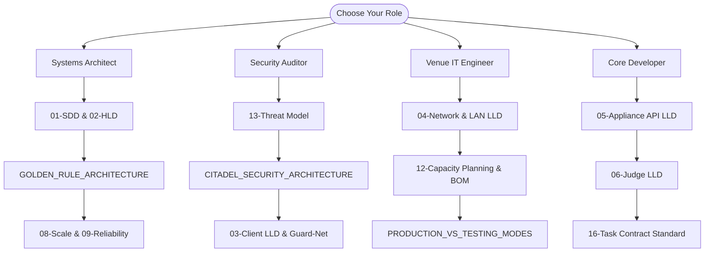

# 📚 CITADEL — System Architecture & Design Specification Suite

> **Product Codename**: CITADEL  
> **Document Set Version**: 2.0 (Hardened Production Baseline)  
> **Target Audience**: Core Systems Engineers, Enterprise Security Reviewers, Venue IT Architects, and Technical Due-Diligence Auditors  
> **Classification**: Commercial Production-Grade Architecture  

---

## 🎯 Executive Overview & What CITADEL Is

**CITADEL** is an air-gapped, zero-trust, local-area-network (LAN) assessment appliance and client software suite engineered to conduct high-stakes coding examinations for **400–700 concurrent candidates** inside college placement auditoriums and corporate recruitment venues with:

- 🚫 **Zero Internet Connectivity**: Completely severed uplink on candidate machines; all scoring, routing, and verification occur locally.
- ☁️ **Zero Cloud Dependency**: Operates 100% autonomously on local hardware appliances without phone-home requirements.
- 🛡️ **Zero Third-Party Lockdown Dependencies**: Replaces Safe Exam Browser with a custom-engineered kernel (WFP) and Win32 Per-Monitor v2 lockdown client.
- 🤖 **Zero Local or Remote LLM Execution**: Prevents both cloud AI (structural lack of internet) and local inference engines (Ollama, llama.cpp, vLLM) via hardware and kernel behavioral controls.
- 🔒 **Server-Side Hidden Test Evaluation**: Candidate laptops only ever see public test cases. Hidden evaluation test cases never leave the appliance sandbox.
- ⚡ **Graceful Network & Node Degradation**: Built-in multi-tier Write-Ahead Logs (WAL) ensure no code loss or exam disruption during local Wi-Fi dropouts or server failover.

### The BYOD & Offline MSB Thesis
CITADEL is specifically engineered for **candidate Bring-Your-Own-Device (BYOD) laptops** running with elevated administrative privileges — the exact deployment model proven at scale by Mercer Mettl Secure Browser (MSB), Safe Exam Browser, and HackerEarth, but with one decisive architectural breakthrough: **the complete elimination of the internet uplink**.

Every commercial lockdown bypass method (remote desktop tunnels, Discord stream-sharing, cloud LLM queries, and covert proxies) fundamentally requires an outbound internet pipe. By structurally eliminating the uplink and running on an air-gapped LAN, CITADEL eliminates the remote cheating vector entirely. The only residual threats on BYOD machines are local tools (defeated by Guard's M1–M5 behavioral and kernel telemetry) and physical out-of-band collusion (handled by human venue invigilators).

---

## 🏛️ The Four Documentation Pillars

The documentation suite is structured into four distinct directories reflecting the system lifecycle:

```
docs/
├── architecture/         # High-level architecture, software design, and security invariants
├── subsystems/           # Detailed Low-Level Design (LLD) specifications for each component
├── operations/           # Capacity planning, operational modes, threat models, and upgradation
└── roadmap/              # Phased implementation roadmaps, senior reviews, and execution playbooks
```

---

## 📑 Complete Document Catalog & Directory Mapping

### 1. Architecture & High-Level Design (`docs/architecture/`)

| # | Specification | Description & Scope | Status |
|---|---|---|---|
| **01** | [`01-SDD-software-design-document.md`](architecture/01-SDD-software-design-document.md) | **Software Design Document (SDD)**: Product scope, functional requirements, NFRs, Assurance Levels (AL1–AL3), complete technology stack, trade-off register, and risks. | `BASELINE` |
| **02** | [`02-HLD-high-level-design.md`](architecture/02-HLD-high-level-design.md) | **High-Level Design (HLD)**: System context, component maps, LAN deployment topologies, end-to-end data flows, and scale arithmetic. | `BASELINE` |
| **SEC** | [`CITADEL_SECURITY_ARCHITECTURE.md`](architecture/CITADEL_SECURITY_ARCHITECTURE.md) | **Deep Security Architecture**: Windows internals, WFP kernel filters, Desktop switches (`WinSta0`), UAC mandatory elevation, Registry ACLs, and failsafe watchdog. | `VERIFIED` |
| **GLD** | [`GOLDEN_RULE_ARCHITECTURE.md`](architecture/GOLDEN_RULE_ARCHITECTURE.md) | **Golden Architecture Rules**: The non-negotiable invariants (Zero-Internet, Single-Session Device Lock, 15m Early Exit Gate, Clean Desktop Restoration). | `ENFORCED` |

### 2. Subsystem Low-Level Designs (`docs/subsystems/`)

| # | Specification | Technical Subsystem & Coverage | Status |
|---|---|---|---|
| **03** | [`03-LLD-lockdown-client.md`](subsystems/03-LLD-lockdown-client.md) | **Lockdown Client (Shell & Guard)**: Win32 Per-Monitor v2 kiosk, `WH_KEYBOARD_LL` hook, registry suppression, local LLM defeat, and Monaco/Ace editor integration. | `ACTIVE` |
| **04** | [`04-LLD-network-routing-and-lan.md`](subsystems/04-LLD-network-routing-and-lan.md) | **Network Routing & Exam LAN**: Appliance-managed DHCP/DNS, VLAN segregation, Wi-Fi 6 enterprise AP sizing, RF pre-flight validation, and 802.1X. | `ACTIVE` |
| **05** | [`05-LLD-exam-appliance-and-api.md`](subsystems/05-LLD-exam-appliance-and-api.md) | **Exam Appliance & Core API**: Axum REST engine, Server-Sent Events (SSE) bus, token authentication, and SQLite persistence schema. | `ACTIVE` |
| **06** | [`06-LLD-judge-and-sandbox.md`](subsystems/06-LLD-judge-and-sandbox.md) | **Judge Engine & Isolation Sandbox**: Judge queue, two-phase grading pipeline, cgroups/JobObject sandboxing, and judge capacity arithmetic. | `ACTIVE` |
| **07** | [`07-LLD-content-authoring-upload-and-distribution.md`](subsystems/07-LLD-content-authoring-upload-and-distribution.md) | **Content Authoring & Pre-Staging**: Problem authoring pipeline, cryptographic bundle signing, pre-staging to candidate machines, and time-locked key release. | `ACTIVE` |
| **08** | [`08-LLD-load-balancing-caching-and-scale.md`](subsystems/08-LLD-load-balancing-caching-and-scale.md) | **Edge Nodes, Caching & Scale**: Distributed edge nodes, 4-tier caching, admission control, backpressure, and thundering-herd mitigation. | `ACTIVE` |
| **09** | [`09-LLD-reliability-failover-and-dr.md`](subsystems/09-LLD-reliability-failover-and-dr.md) | **Reliability, Failover & Disaster Recovery**: Active-passive HA appliance pair, multi-tier Write-Ahead Logs (WAL), split-brain protection, and chaos drills. | `ACTIVE` |
| **10** | [`10-LLD-integrity-analytics-and-proctoring.md`](subsystems/10-LLD-integrity-analytics-and-proctoring.md) | **Integrity Analytics & Proctoring**: Real-time telemetry schema, anomaly detection, code similarity clustering, incident runbooks, and evidence capture. | `ACTIVE` |
| **11** | [`11-LLD-admin-console-and-operations.md`](subsystems/11-LLD-admin-console-and-operations.md) | **Admin Console & Recruiter Portal**: Proctor UI, role-based access control (RBAC), venue pre-flight checklist, and live exam-day dashboard. | `ACTIVE` |

### 3. Operations, Security & Capacity (`docs/operations/`)

| # | Specification | Focus Area & Purpose | Status |
|---|---|---|---|
| **12** | [`12-capacity-planning-and-bom.md`](operations/12-capacity-planning-and-bom.md) | **Hardware Sizing & Bill of Materials (BOM)**: Infrastructure specs for 200, 400, 600, and 1000 concurrent candidate tiers with full hardware cost models. | `BASELINE` |
| **13** | [`13-security-threat-model.md`](operations/13-security-threat-model.md) | **Threat Model & Attack Trees**: STRIDE matrix, physical dongle attacks, local LLM attack trees, and explicit mitigation boundaries. | `BASELINE` |
| **OPS** | [`PRODUCTION_VS_TESTING_LOCKDOWN_MODES.md`](operations/PRODUCTION_VS_TESTING_LOCKDOWN_MODES.md) | **Testing Mode vs. Production Mode Guide**: Comprehensive comparison of open access developer mode vs. hardened cryptographic gatekeeper lockdown mode. | `ENFORCED` |
| **CHG** | [`upgradation.md`](operations/upgradation.md) | **Platform Upgradation & Feature Status**: Verification status of dual-mode gating, strict application scanning, UAC elevation, and recovery automation. | `MAINTAINED` |

### 4. Implementation Roadmaps & Playbooks (`docs/roadmap/`)

| # | Specification | Roadmap Stage & Guidance | Status |
|---|---|---|---|
| **14** | [`14-implementation-roadmap.md`](roadmap/14-implementation-roadmap.md) | **Engineering Roadmap**: Engineering phases, sprint breakdown, milestones, team topology, and MVP feature scoping. | `BASELINE` |
| **15** | [`15-senior-review-and-hardened-lockdown-v2.md`](roadmap/15-senior-review-and-hardened-lockdown-v2.md) | **Senior Architecture Review v2**: Hardened edge-case analysis, Wi-Fi 6 default topology, and process watchdog hardening. | `BASELINE` |
| **16** | [`16-implementation-playbook-task-contract-standard.md`](roadmap/16-implementation-playbook-task-contract-standard.md) | **Implementation Playbook Standard**: Task contracts, engineering delivery criteria, quality gates, and code verification protocols. | `BASELINE` |
| **17** | [`17-implementation-plan-p0-spike.md`](roadmap/17-implementation-plan-p0-spike.md) | **P0 Spike Implementation Plan**: Detailed verification plan for phase zero, proof-of-concept experiments, and validation benchmarks. | `COMPLETED` |

---

## 🧭 Reading Guides by Stakeholder Persona



### 1. System & Enterprise Architects
1. Start with [`01-SDD-software-design-document.md`](architecture/01-SDD-software-design-document.md) to review business requirements, assurance levels, and the trade-off register.
2. Read [`02-HLD-high-level-design.md`](architecture/02-HLD-high-level-design.md) for data flows, network topologies, and scale models.
3. Review [`GOLDEN_RULE_ARCHITECTURE.md`](architecture/GOLDEN_RULE_ARCHITECTURE.md) to understand non-negotiable operational invariants.
4. Study [`08-LLD-load-balancing-caching-and-scale.md`](subsystems/08-LLD-load-balancing-caching-and-scale.md) and [`09-LLD-reliability-failover-and-dr.md`](subsystems/09-LLD-reliability-failover-and-dr.md).

### 2. Security Auditors & Due-Diligence Reviewers
1. Start with [`13-security-threat-model.md`](operations/13-security-threat-model.md) for STRIDE analysis, attack trees, and capability boundaries.
2. Read [`CITADEL_SECURITY_ARCHITECTURE.md`](architecture/CITADEL_SECURITY_ARCHITECTURE.md) for the deep Windows kernel WFP, desktop isolation, and registry ACL mechanisms.
3. Read [`03-LLD-lockdown-client.md`](subsystems/03-LLD-lockdown-client.md) and [`10-LLD-integrity-analytics-and-proctoring.md`](subsystems/10-LLD-integrity-analytics-and-proctoring.md).
4. Review [`15-senior-review-and-hardened-lockdown-v2.md`](roadmap/15-senior-review-and-hardened-lockdown-v2.md).

### 3. Venue Network & IT Infrastructure Engineers
1. Read [`04-LLD-network-routing-and-lan.md`](subsystems/04-LLD-network-routing-and-lan.md) for Wi-Fi 6 AP radio configurations, VLAN design, and DHCP/DNS authority.
2. Review [`12-capacity-planning-and-bom.md`](operations/12-capacity-planning-and-bom.md) for exact hardware Bills of Materials and switch/server sizing.
3. Follow [`PRODUCTION_VS_TESTING_LOCKDOWN_MODES.md`](operations/PRODUCTION_VS_TESTING_LOCKDOWN_MODES.md) and [`11-LLD-admin-console-and-operations.md`](subsystems/11-LLD-admin-console-and-operations.md) for venue execution checklists.

### 4. Core Systems Developers & Maintainers
1. Study [`05-LLD-exam-appliance-and-api.md`](subsystems/05-LLD-exam-appliance-and-api.md) for Axum routes, SSE telemetry channels, and SQLite schema.
2. Study [`06-LLD-judge-and-sandbox.md`](subsystems/06-LLD-judge-and-sandbox.md) for code compilation, sandbox limits, and judge capacity arithmetic.
3. Follow [`16-implementation-playbook-task-contract-standard.md`](roadmap/16-implementation-playbook-task-contract-standard.md) for task delivery and testing requirements.
4. Review [`upgradation.md`](operations/upgradation.md) for historical milestone achievements.

---

## ⚡ The Five Architectural Decisions That Define Citadel

Every design choice across these specifications anchors back to five foundational decisions:

1. **D1 — Pre-stage the exam bundle; release only a 32-byte key at T=0.**  
   Instead of 600 candidates attempting to download 5 MB question bundles simultaneously (a 3 GB network thundering herd that degrades campus APs), the entire encrypted bundle is pre-cached on student machines days prior. At exam start, the appliance broadcasts an ephemeral 32-byte key.
2. **D2 — Built-in Monaco/Ace editor; strictly no third-party IDE or terminal.**  
   Providing VS Code or terminal access opens arbitrary process execution and socket creation. Citadel embeds an offline Ace/Monaco code editor with a tightly bounded test-runner that can only execute against public sample cases via the Guard sandbox.
3. **D3 — Enforce at the OS and Kernel layer, not the window layer.**  
   Traditional browser kiosks (e.g., Safe Exam Browser) control a user-mode window. Citadel enforces at the Windows Filtering Platform (WFP kernel network driver), Win32 `WH_KEYBOARD_LL` low-level hooks, and Windows Station/Desktop boundaries (`WinSta0`).
4. **D4 — Detect behavioral techniques, not static process filenames.**  
   Cheaters easily rename `ollama.exe` to `svchost.exe`. Citadel detects anomalous local loopback socket listeners, dedicated GPU VRAM consumption, and screen-capture exclusion flags (`WDA_EXCLUDEFROMCAPTURE`).
5. **D5 — Multi-Tier Write-Ahead Log (WAL) at every layer.**  
   The Kiosk client, Edge cache nodes, and Appliance server each maintain an append-only WAL. If an AP drops offline mid-exam, the candidate continues coding uninterrupted. Submissions queue locally and flush automatically upon reconnection with zero data loss.

---

## 📊 Headline Scale & Capacity Benchmark

| Metric | Specification Target | Proven Engineering Solution | Reference |
|---|---|---|---|
| **Concurrent Candidates** | 400–700 active BYOD laptops | Edge node caching + D1 pre-staging | [`02-HLD`](architecture/02-HLD-high-level-design.md) |
| **Peak Appliance Bandwidth** | < 2.0 MB/s steady state | 32-byte key release + SSE streaming | [`08-LLD`](subsystems/08-LLD-load-balancing-caching-and-scale.md) |
| **Wi-Fi Infrastructure** | 12–14 Wi-Fi 6 Enterprise APs | Appliance-owned DHCP/DNS, WPA3-Enterprise, client isolation | [`04-LLD`](subsystems/04-LLD-network-routing-and-lan.md) |
| **Judging Capacity** | 16–32 dedicated CPU cores | Two-phase judging (local public + server hidden) | [`06-LLD`](subsystems/06-LLD-judge-and-sandbox.md) |
| **Network Fault Tolerance** | 100% survivable AP dropouts | Client-side SQLite/JSON Write-Ahead Log | [`09-LLD`](subsystems/09-LLD-reliability-failover-and-dr.md) |

---

## 📖 System Terminology & Glossary

| Term | Architectural Definition |
|---|---|
| **Appliance** | The primary Citadel server hardware unit. Runs `citadel-server`, hosts the Axum REST API, SSE telemetry bus, SQLite state engine, and sandbox judge. |
| **Edge Node** | Optional per-hall/lab caching proxy relaying submissions and pre-staged content bundles. |
| **Guard** | The privileged background enforcement service (`guard-svc`) and WFP driver (`guard-net`) running with SYSTEM/Administrator rights on the student laptop. |
| **Shell / Kiosk** | The foreground Win32 Per-Monitor v2 window (`citadel-client`) hosting the Edge/Chromium exam webview with low-level keyboard locking. |
| **Forge** | The integrated, sandboxed code editor (Monaco/Ace) and local run harness inside the exam portal. |
| **Bundle** | The cryptographically signed, AES-256-GCM encrypted package containing exam questions and public test cases. |
| **Assurance Level (AL)** | Formal deployment trust rating: **AL1** (LiveBoot read-only OS), **AL2** (Standard BYOD with Guard lockdown — primary production tier), and **AL3** (Unattended/Mock exam). |
